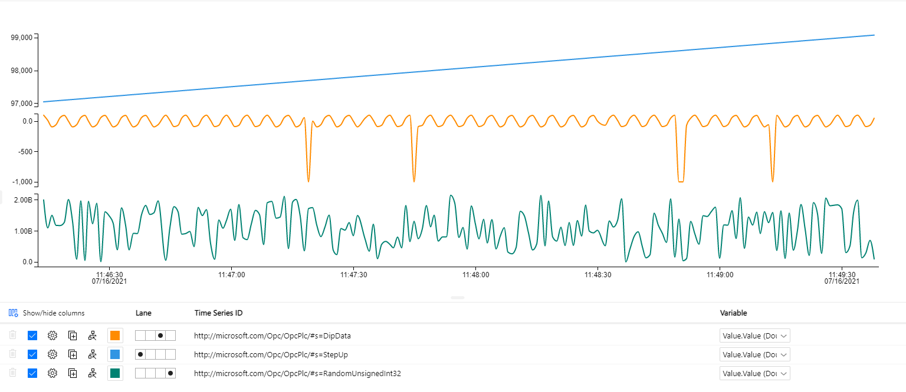

# Deploy IoT Edge OPC UA Publisher module to IoT Edge device (PoC)

## Abstract

This document provides a step-by-step approach for deploying the [OPC UA publisher IoT Edge module](https://github.com/Azure/iot-edge-opc-publisher) on an IoT Edge device.

## Create an IoT Edge Device

### Register a new IoT Edge device in IoT Hub

This can be done via the Azure Portal, or via the commandline, by executing this CLI command:

```azcli
az iot hub device-identity create --device-id <my_device_id> --edge-enabled --hub-name <iothubname>
```

### Deploy an Azure VM which will act as the IoT Edge device

For this PoC, an Azure VM will be used which hosts the IoT Edge runtime.
We'll provision the VM and make sure that we can logon to it via ssh.

#### Generate SSH keys

First, a ssh keyset must be generated which will be used to get remote access to the VM.

Execute this command:

```powershell
ssh-keygen -m PEM -t rsa -b 4096 -f opcua_iotedge_vm.pem
```

This commands generates 2 files:
- opcua_iotedge_vm.pem:  the private key that should be stored in a secured location
- opcua_iotedge_vm.pub: the public key for this keyset.

#### Deploy VM with IoT Edge pre-installed

There exists an ARM template which deploys a Linux virtual machine which has IoT Edge pre-installed.  The VM can be easily provisioned by executing this command:

```powershell
az deployment group create `
  --resource-group <resourcegroup where the VM must be deployed> `
  --template-uri "https://raw.githubusercontent.com/Azure/iotedge-vm-deploy/1.2.0/edgeDeploy.json" `
  --parameters dnsLabelPrefix='<name of the VM>' `
  --parameters adminUsername='<username>' `
  --parameters deviceConnectionString=$(az iot hub device-identity connection-string show --device-id <my_device_id> --hub-name <iothubname> -o tsv) `
  --parameters authenticationType='sshPublicKey' `
  --parameters adminPasswordOrKey="<paste contents of ssh.pub file>"
```

Once the resources have been deployed, you'll see the 'outputs' being written to the screen.  Take note of the publicFQND and/or publicSSH properties.  (Note, this information can also be found again via the Azure Portal)

#### SSH to the VM

Once the virtual machine has been created, you can log on to it via ssh by executing this command:

```powershell
ssh -i <myprivatekeyfile> <username>@<fqdn of VM>
```

for instance:

```powershell
ssh -i opcua_iotedge_vm.pem fgheysels@myvirtualmachine.westeurope.cloudapp.azure.com
```

#### Check if IoT Edge is running on the VM

Once logged in to the VM, check if IoT Edge is running by executing these commands:

```bash
sudo iotedge check
```

```bash
iotedge list
```

### Deploy OPC UA publisher module to the IoT Edge device

[This documentation page](https://github.com/Azure/iot-edge-opc-publisher) on GitHub describes how the OPC UA publisher module can be deployed on an IoT Edge device.

We can also use the command line and a deployment manifest to do the same.

#### Prepare the Edge Device

If there are already multiple IoT Edge devices registered in the IoT Hub, it is advised to first define a tag in the Device Twin of the Edge Device in IoT Hub.  We do not want to publish the deployment manifest to all devices in IoT Hub, instead, we only want to target one specific device in this PoC.

- Navigate to the IoT Edge blade of your IoT Hub in the Azure Portal
- Select the IoT Edge device that is used in this PoC which will host the OPC UA publisher
- Open the Device Twin
- Add a property `tags` to the JSON document, and specify a specific tag where we can filter on.
  
  ```json
  "version": 3,
    "tags": {
        "opcua": true
    },
    "properties": {
  ```

#### Deploy the IoT Edge manifest to IoT Hub

This repository contains a file `deployment.json`.  This file is a deployment manifest which describes which modules must be deployed.  Next to the edgeHub and edgeAgent system modules, this manifest also describes that the OPC UA Publisher module must be deployed.

Execute this command to deploy the modules to the edge device:

```powershell
$deploymentName = "opcua_$(Get-Date -Format yyyyMMdd)"

az iot edge deployment create -d $deploymentName --content .\deployment.json -l "<iothubconnectionstring>" --target-condition "tags.opcua = true"
```

Note that the `target-condition` works on the `tags` property.  This makes sure that only devices that have this specific tag are targetted by the deployment.

After a few moments, you'll see in IoT Hub that the deployment targets the device that has been registered and the deployment should be applied to that device.

When executing this command on the VM that runs IoT Edge:

```bash
iotedge list
```

You should see that IoT edge is running these modules:

- edgeHub 1.2
- edgeAgent 1.2
- OPCPublisher

Now, the IoT Edge device is able to listen to OPC UA events.

## Setup a Mock which simulates an OPC UA server that exposes telemetry via OPC UA

There exists a GitHub repository which contains a OPC UA Server simulator.  It can be found [here](https://github.com/Azure-Samples/iot-edge-opc-plc).
Deploying it is just a matter of clicking the 'Deploy to Azure' button.

## Connect the OPC UA Publisher module to the OPC UA Server Simulator

The OPCPublisher module is currently not receiving any data since it is not configured yet.
Moreover, if the command `iotedge logs OPCPublisher` is executed, you can see that the module is not functioning correctly:  there is no configuration file available.

The `containerCreate` options of the OPCPublisher module state:

```json
{
  "HostConfig": {
    "Binds": [
      "/etc/iiotedge:/appdata"
    ]
  },
  "Hostname": "opcpublisher",
  "Cmd": [
    "--pf=/appdata/publishednodes.json",
    "--aa"
  ]
}
```

The configuration file must be named `publishednodes.json` and must exist in the `/appdata` folder that exists inside the container.
The `/etc/iiotedge` folder which should exist on the Host (The VM that runs iotedge) is mounted to the `/appdata` folder in the container.

### Configuration

The `publishednodes.json` should look like this:

```json
[
  {
    "EndpointUrl": "opc.tcp://aci-contoso-g4mwza6-plc1.westeurope.azurecontainer.io:50000",
    "UseSecurity": false,
    "OpcNodes": [
      { "Id": "ns=2;s=AlternatingBoolean" },
      { "Id": "ns=2;s=DipData" },
      { "Id": "ns=2;s=NegativeTrendData" },
      { "Id": "ns=2;s=PositiveTrendData" },
      { "Id": "ns=2;s=RandomSignedInt32" },
      { "Id": "ns=2;s=RandomUnsignedInt32" },
      { "Id": "ns=2;s=SpikeData" },
      { "Id": "ns=2;s=StepUp" }
    ]
  }
]
```

The `EndpointUrl` can be found in the logs of the OPC UA Server Simulator that is running in the Azure Container Instance that has been deployed.
Actually, the complete JSON of how this file should look like, can be found in the logs of the OPC UA Server Simulator.

### Verification

Once the configuration file is created, check if everything is working as expected.

On the IoT Edge VM, look at the logs of the OPCPublisher module:

```bash
iotedge logs OPCPublisher
```

If everything works well, you should see that the module emits diagnostics regarding the telemetry that it has collected.

In IoT Hub, you should also see that messages are being received.

## Get Telemetry information into a Timeseries database

Now that we have the OPCPublisher IoT Edge module up and running, and it is extracting telemetry from an OPC UA simulator, the next step is to get that information into a Timeseries database.
For the sake of simplicity, we'll use Timeseries Insights, but Azure Data Explorer can be used as well.

### Configure OPCPublisher to specify the message-format that must be used

The OPCPublisher can be configured via commandline options.  Documentation can be found [here](https://github.com/Azure/iot-edge-opc-publisher/blob/main/docs/CommandLineArguments.md).

#### Use the standardized OPC UA JSON format

To use the standardized OPC UA format, specify these commandline arguments:

- `--me=Json`
- `--mm=PubSub`

#### Use the simplified TSI compatible JSON format

- `--me=Json`
- `--mm=Samples`

### Setup a Timeseries Insights database

- Define a consumer-group on the IoT Hub or EventHub that receives the messages published by IoT Edge
- Add a Timeseries Insights resource in Azure
- Specify `NodeId` as the property-name for the Timeseries ID.  `NodeId` is the name of the property in the messages sent by OPCPublisher that identifies a metric:

  ```json
  [
    {
        "NodeId": "http://microsoft.com/Opc/OpcPlc/#s=AlternatingBoolean",
        "ApplicationUri": "urn:OpcPlc:aci-contoso-g4mwza6-plc1",
        "Value": {
            "Value": true,
            "SourceTimestamp": "2021-07-16T07:21:13.316076Z"
        }
    }
  ]
  ```

  Note: it is also possible to specify more (up to 3) property-names.  If `ApplicationUri` + `NodeId` uniquely identifies a tag, this combination should be used.

  Important: pay attention that the correct casing is used, as a case-sensitive search will be performed.

- Setup an EventSource:  this will make sure that data that is delivered on an EventHub or IoT Hub is ingested into Time Series Insights.
  Make sure that the consumer-group that has been created in the first step is used.
- Finally, the property-name for the timestamp must be specified.  Specify `Value.SourceTimestamp`.  (Pay attention to the casing!)

After a few moments, data should be flowing in in Timeseries Insights.  
Navigate to `https://insights.timeseries.azure.com`, and visualize the data:

